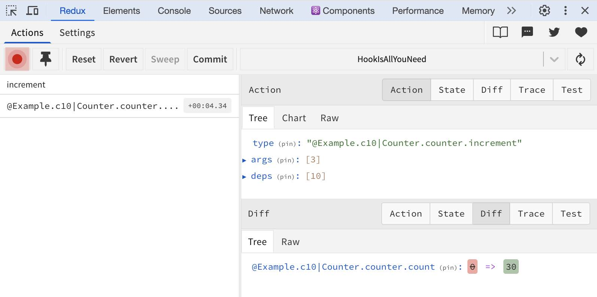
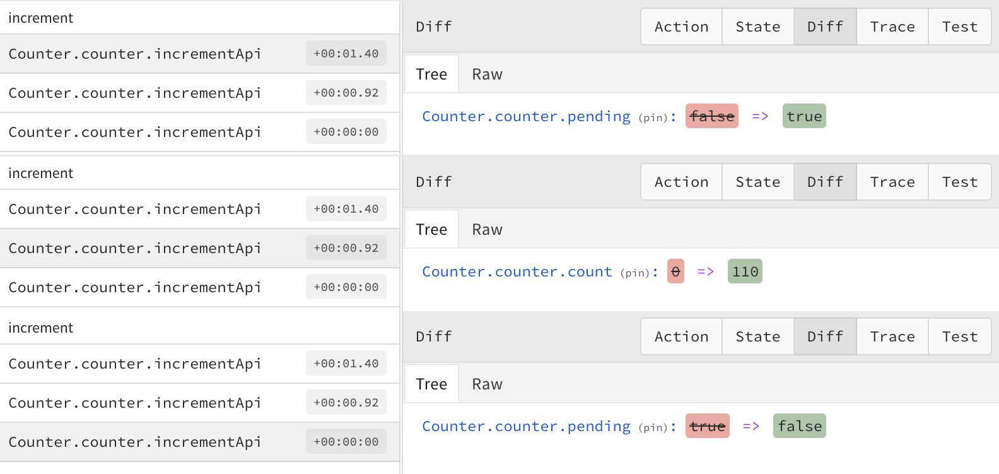

# Hook Is All You Need (HIAYN)

Hook Is All You Need (HIAYN) is a design pattern for React developers to manage complex state without needing to learn any third-party state management libraries.

HIAYN offers a 0-API, 0-learning curve, 0-boilerplate solution that is performant, DevTools-powered (with time travel and logging), supports async flow, and provides compositional, immutable, decentralized state management. It is also test-friendly and TypeScript-safe.

## Why HIAYN?

Have you ever wondered why React developers often have to learn third-party state management libraries after mastering React hooks? The philosophy behind these libraries often diverges significantly from React itself, making it feel like you're not using React anymore. But do we really need them?

No, we don’t. React’s built-in hooks, such as `useState`, `useCallback`, and `useContext`, are powerful enough to manage even the most complex state. The challenge is that the design patterns are not well-structured and lack DevTools support.

# HIAYN Interceptor

HIAYN's Interceptor allows you to view state changes from any `useState` hook, along with the triggering `useCallback`, in Redux DevTools.



You can even click the "Jump" button on an action to time travel to that state.

Here’s the example:

```tsx
import { useState, useCounter } from "hook-is-all-you-need";

function useCounter(base: number) {
  const [count, setCount] = useState(0);

  const increment = useCallback(
    (mul: number) => setCount((count) => count + base * mul),
    [base]
  );
  return { count, increment };
}

function Counter({ base }: { base: number }) {
  const counter = useCounter(base);
  const { count, increment } = counter;

  return (
    <div>
      <div>Count: {count}</div>
      <button onClick={() => increment(3)}>increment</button>
    </div>
  );
}
```

Let's explore it in depth

## Action

useCallback is a Redux action.

```js
type: "@Example.c10|Counter.counter.increment";
args: [3];
deps: [10];
```

- `@Example.c10|` refers to the scopes, which we’ll discuss later
- `Counter` is the function component name
- `counter` is the variable name of the hook call (`const counter = useCounter`)
- `increment` is the callback variable name (`const increment = useCallback`)
- `args` are the arguments of the `increment` callback (`(mul: number)`)
- `deps` are the dependencies of the `increment` callback (`[base]`)

## State

useState is a Redux reducer

```js
@Example.c10|Counter.counter.count: 0 => 30
```

- `@Example.c10|`, `Counter`, `counter` are the same as above
- `count` is the state variable name (`const [count, setCount] = useState`)
- The state changed from `0` to `30`.

## Scopes

The `Counter` component is used in `App`:

```tsx
import { ScopeProvider } from "hook-is-all-you-need";

function App() {
  return (
    <ScopeProvider scope="Example">
      <ScopeProvider scope="c10">
        <Counter base={10} />
      </ScopeProvider>
      <ScopeProvider scope="c100">
        <Counter base={100} />
      </ScopeProvider>
    </ScopeProvider>
  );
}
```

In `@Example.c10|`, `Example` is from the parent `ScopeProvider`, and `c10` is from the child `ScopeProvider`.

Scopes help distinguish multiple instances of the same component and are concatenable.

Scopes are not necessary if your component names are unique.

## Setup

Initialize `Interceptor` and wrap `InterceptorContext` around your root component.

```tsx
import { Interceptor, InterceptorContext } from "hook-is-all-you-need";

const interceptor = new Interceptor();

root.render(
  <InterceptorContext.Provider value={interceptor}>
    <App />
  </InterceptorContext.Provider>
);
```

And use `useState` and `useCallback` from the `hook-is-all-you-need` package instead of `react`, as demonstrated in the example code above.

## Concept

That’s all you need to use HIAYN!

It’s a 0-API, 0-learning curve, 0-boilerplate, DevTools-powered, test-friendly, TypeScript-safe, immutable and decentralized state management pattern, as promised.

### Core Concepts

- Custom hooks act as data models or stores in Redux
  - Easy to test
  - Compositional and supports `extraReducers` by nature
- Callbacks are actions of reducers:
  - The callback itself is the action type
  - `args` are the action payload
  - `deps` are static data in the action creator
- Reducers are non-reusable and useless

## Async flow

For example, let’s say we have an `incrementApi` callback. It sets `pending` to true, updates `count` after the API promise resolves, and then sets `pending` to false.

```tsx
function useCounter() {
  // ...
  const incrementApi = useCallback(async function () {
    setPending(true);
    const inc = await api(base);
    setCount((count) => count + inc);
    setPending(false);
  }, [base]);
```

HIAYN Interceptor supports asynchronous operations in callbacks, ensuring state changes are accurately linked to the correct callbacks.



To make it work, for async callbacks, you need to change

- `async function` to a generator function `function*`
- `await` to `yield`.

```tsx
function useCounter() {
  // ...
  const incrementApi = useCallback(function* () { // async function -> function*
    setPending(true);
    const inc = yield api(base); // await -> yield
    setCount((count) => count + inc);
    setPending(false);
  }, [base]);
```

You can find a fully functional example in the "examples" folder.
